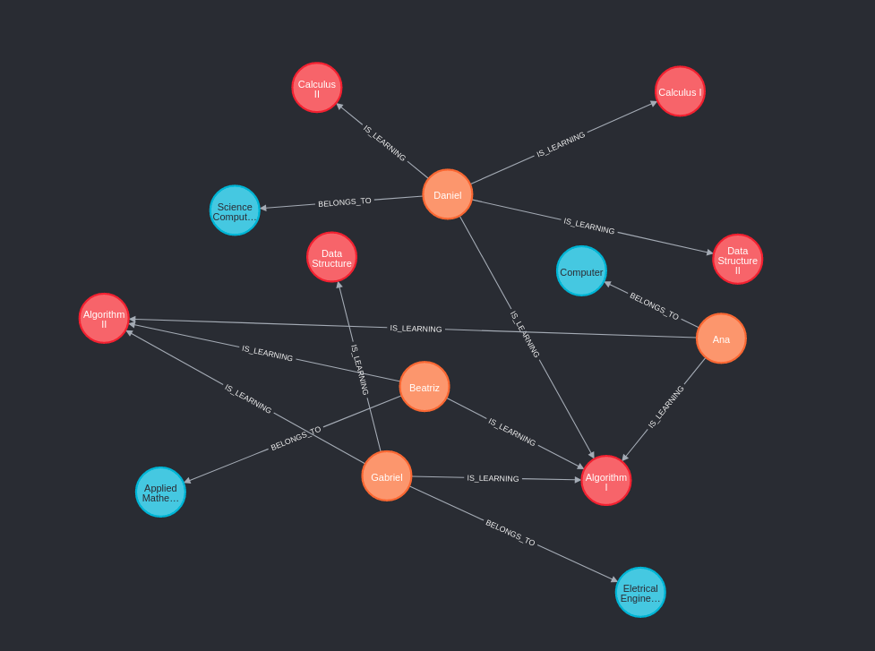

# Spring boot & Spring Data Neo4j Sandbox

Projeto criado para estudar as funcionalidades do projeto `Spring Data Neo4j` em conjunto com o framework
`Spring Boot`.



O projeto expõe as informações do banco de dados através de uma `API REST` para criar informações relacionadas à entidade `Student` que possui
relacionamentos com `Department` e `Subject`.

### Banco de dados Neo4j

O banco de dados Neo4j utilizado na aplicação está dockerizado. Para levantar o banco com uma massa de dados pré criada é necessário executar
o `docker-compose` da pasta `db`.

```dockerfiler
docker-compose up --build
```

Esse comando irá criar o container com o banco `Neo4j` e irá criar uma massa de dados inicial disponível no repositório. Para isso é utilizado um
script desenvolvido pelo usuário [marcellosales](https://github.com/marcellodesales/neo4j-with-cypher-seed-docker), esse script continuará sendo
executado após subir o container.

Assim, a execução utilizado o `build` deve ser feita apenas na criação do banco com a massa, após isso deve-se utilizar o comando para levantar o
container:

```dockerfiler
dokcer-compose up -d
 ```

### TODO

- [ ] Adicionar `HATEOAS` ao projeto.
- [ ] Centralizar mensagens com o `Message Source`
- [ ] Centralizar exceções com o `Global Exception Handler`
- [ ] Aplicar testes de integração nos endpoints da api.
- [ ] Aplicar testes unitários em todas as funcionalidades.


